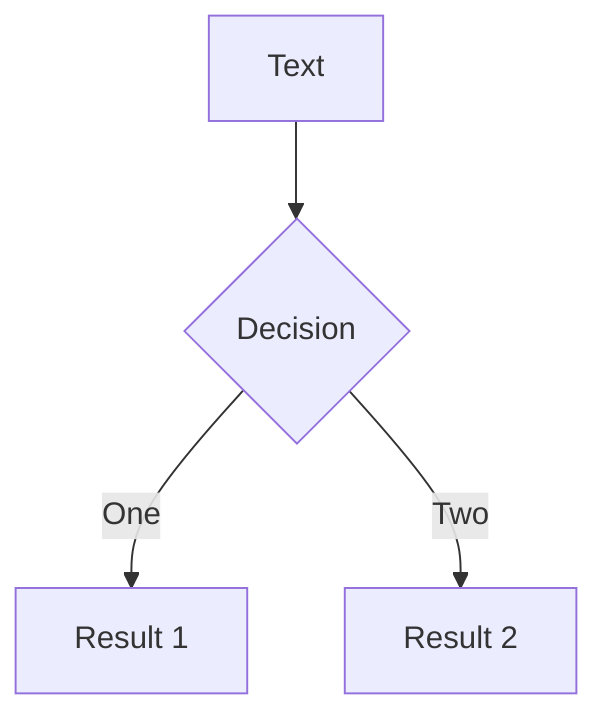

# Slidev

This is the cover page.


---

# Page 2

This is a page with the layout `center` and a background image.
```ts {2,3}
function add(
  a: Ref<number> | number,
  b: Ref<number> | number
) {
  return computed(() => unref(a) + unref(b))
}
```
---

# Page 3

This is a default page without any additional metadata.

```ts {2-3|5|all|1|2|3}
function add(
  a: Ref<number> | number,
  b: Ref<number> | number
) {
  return computed(() => unref(a) + unref(b))
}
```

```ts {monaco}
console.log('HelloWorld')
```


---

# Page 4


<style>
h1 {
  color: red
}
</style>

---

# Next slide is not affected

---
layout: cover
---

# 第 1 页

This is the cover page.

<!-- 这是一条备注 -->

---

# 第 2 页

<!-- 这不是一条备注，因为它在幻灯片内容前 -->

The second page

<!--
这是另一条备注
-->
1. hello
2. world

